# Tree-of-AST
Tree-of-AST is a static-pseudocode analysing approach inspired by
[Tree of Thoughts: Deliberate Problem Solving with Large Language Models](https://arxiv.org/abs/2305.10601) that can be used in both security-analysis and jobs debugging tracing backs, **However, in Tree-of-AST we are creating a `Tree-of-AST` embed with both `code` generated by AST tools and  and `LMs`'s thought.** With a basic input point, we can use **evaluation** on both tree note pobabilty and creating a sub-tree of LM's response

## Chain-Of-thought && backgrounds
Inspired by [Tree of Thoughts: Deliberate Problem Solving with Large Language Models](https://arxiv.org/abs/2305.10601), A solution combining **the tree** of Aspartate transferase and **the tree** of Chain-Of-thought. **However, we are not using chain-of-thought but creating a Chain-of-attack in favor of construction** of ToTs, including heuristically evaluating states;





### ToT
Construction of ToT can be summerized by four question metion in the paper:
1. How to decompose the intermediate process into thought steps;
2. How to generate potential thoughts from each state; 
3. How to heuristically evaluate states; 
4. What search algorithm to use.

Focused on the job on analysing via AST, in this case we specific analysing possible vulnerabilities, we can conclude that:

1. Informations will given ( Potential Vulnerabilty: Tools like `bandit`, Tree construction: AST )
2. To generate possible `K`, choosing from `Sampling`, and `Proposing`, we will use `Proposing` since `Proposing` works better when the thought space is more constrained (e.g. each thought is just a word or a line), so proposing different thoughts in the same context avoids duplication.
3. Choosing from `Vote` and `Value` or using together, we choose **COMBINING TWO BOTH**. Since vulnerabilty analysing jobs required both parallel judgement and future possible prediction, the final call will be considered with weight of 8:2 in 10.
4. `Depth-first search (DFS)` since we are actually conduction analysis on a existing possible vulnerabilty existence.

The whole workflow should be like:
```
1. Static vulnerabilty existence detection (Bandit for instance)
2. AST Tree building from and analysing (Finding xreferences and input)
3. Eval Tree notes reversely using `Vote` and `Value` of external LMs
    * If Note score > threshold, mark current note and restart on previous doubtful note using BHF.
    * If no Note score > threshold Until the final note is reached (t > T), mark as none.

4. Finally, export the marked branch, in further discussions, we will call it "Tree-of-AST"
```
### Exploitations
For exploitations, We will use another approach based on ToT. To begin with, we will start on from tail-to-Head travaling the Tree-of-AST in order to proceed inverse operation of the Vuln-input. For each note we met in the original Tree-of-AST, we will call it a layer; For each layer we met, we will use LMs ( no-shot or few shot ) to generate a part of exploit, these exploits will be embed in this layer of Tree-of-AST.

Same as ToT goes, will will generate multiple note of exploits in a layer, however, we will only evaluate them in `vote`, `value` with `lookahead simulations` in order to avoid issues such as unsure type, after this round of travel. Thus the weight should be 2:8 now

In exploitation process, we might face possibility that we can insert arbitrary since in this layer this part have not encountered any limitation, in this case, we will leave this part with `<arbitrary>` tag to avoid future asserts since we are traveling from Tail-To-Head.

Additionally, if `<arbitrary>` encounted unspecificed assert, such as len(), we can modify it by adding a limitation porperty `<arbitrary limit='length < 7'>`. 

Or we can re-travel the tree from head-to-tail, using ToT to reconstruct arbitrary


 ```python
import os

class UserInput:
    def __init__(self,input) -> None:
        self.input = input
        
    def __setattr__(self, name, value):
        print(f'[!] {name} now is {value}')
        super().__setattr__(name, value)

def vuln(input=input('Your address: ')):
    # ANALYSIS-TOP: [<arbitrary>, <arbitrary>, <arbitrary>retr0reglove<COMMAND>]

    user_input = UserInput(input=input).input

    # ANALYSIS: tytytyty<arbitrary>, <arbitrary>, <arbitrary>retr0reglove<COMMAND>

    if 'tytytyty' not in user_input[:7]:
        exit(0)
    else:
        user_input = user_input[7:]

    # ANALYSIS: <arbitrary>, <arbitrary>, <arbitrary>retr0reglove<COMMAND>
    user_input = user_input.split(',')

    # ANALYSIS UNSURE TYPE, lookahead simulations
    # ANALYSIS: [<arbitrary>, <arbitrary>, <arbitrary>retr0reglove<COMMAND>]
    user_input = user_input[3]
    
    # ANALYSIS: <arbitrary>retr0reglove<COMMAND>,
    #           retr0reg<arbitrary>love<COMMAND>
    if not 'retr0reg' in user_input:
        exit()

    # ANALYSIS-TAIL: <arbitrary>love<COMMAND>
    user_input = user_input.split('love')[1] 
    
    return os.system(user_input)

vuln()

 ```
 For Tree-of-AST perspective

 ```
    Tree-of-AST of os.system(user_input):

        TOP: input=input('Your address: ')
         1-: user_input = user_input.split(',')
         2-: user_input = user_input[3]
         3-: if not 'retr0reg' in user_input:\n exit()
         4-: user_input = user_input.split('love')[1] 
       TAIL: os.system(user_input)

    EXPLOITING TAIL->HEAD：
    TAIL:  # ANALYSIS-TAIL: <arbitrary>love<COMMAND>
       4:  # ANALYSIS: <arbitrary>retr0reglove<COMMAND> or retr0reg<arbitrary>love<COMMAND>
       3:  # ANALYSIS: <arbitrary>retr0reglove<COMMAND>, or retr0reg<arbitrary>love<COMMAND>
       2:
       1:
    HEAD: 

 ```